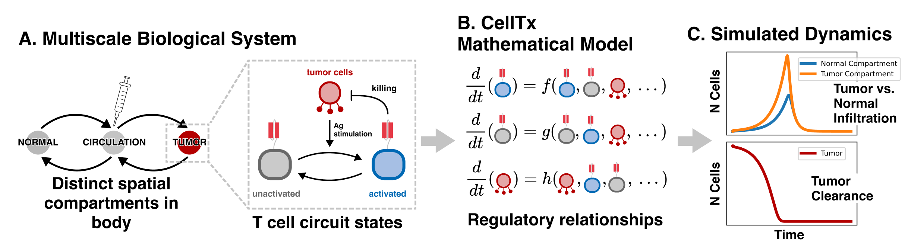

# celltx

> Cell Therapy: Cell CAD framework for dynamically constructing and evaluating multiscale models of cell therapies.

## Status
[](https://celltx.readthedocs.io/en/latest/?badge=latest)

## Abstract
celltx is a framework for building, visualizing, and simulating multiscale models of live cell therapies. celltx consists of a series of abstraction layers, which bridge model specifications which are biologically intuitive with model representations that are mathematically rigorous and numerically evaluable. At present, celltx converts a set of biological specifications into a directed graph, and further computes a system of differential equations representing the state of the biological system over time from the graph.



## Installation

**Installing the Package**

After cloning this repository, issue the following command from the root directory.

```
python setup.py install
```

Or better yet, using `pip`:
```
pip install .
```

**Building Documentation**

The documentation is managed with Sphinx. To build the documentation, issue the following from the 
root directory.

```
cd docs
make html
```

To regenerate the docs automatically from from the docstrings, use `sphinx-apidoc`:

```
cd docs
sphinx-apidoc -o source/ ../celltx/
```

## Abstraction Layer Architecture

**Biology Layer - tx_cells, cell, cytokines**

The biology layer is a lightweight interface that makes it easy to create common systems of compartments, elements, and relationships.

- **compartments** passthrough to systems layer compartments
- **tx_cells** (e.g. a synNotch → CAR T cell) are elements which:
    - have one or more internal binary states describing circuitry (e.g. primed, activated), which are linked in specific ways using edge functions that depend on compartmental variables
    - have birth, death, killing, secretion, and migratory functions that may depend on their states and/or the values of other elements the system.
    - tx_cells have circuitry relationships that are always intracompartmental linkages that depend only on compartmental entities.
- **cells** (e.g. normal or tumor cells) are compartment-specific elements which:
    - have birth and death functions that may depend on the values of other elements in the system
- **cytokines** are elements with a value for each compartment which:
    - have degradation functions
    - have diffusion functions which govern their migration throughout compartments
- At this level, interactions are not necessarily linkages between states. For instance, target cell killing is a property of Tx cells.

**Systems Layer – Compartments, Elements, and Relationships**

The systems layer aims to describe the structure of a biological system in a generalized fashion that is still easily interpretable and manipulated. 

- **Compartments** are regions of biological space (e.g. tumor, normal tissue, and circulation) through which species can travel. The compartments in a system have linkages that specify their topology.
- **Elements** are a generalization of biological species, which can have arbitrary internal states. Elements may be global to the system, or compartment specific.
- **Relationships** are a generalization of interactions between biological species. Relationships describe the impact of one element state on another using functions which may be dependent on constants and the values of elements in the system.

**Graph Layer - Entities and Linkages**

The graph layer describes the structure and states of a biological system rigorously in the form of a directed graph.

- **Nodes** in the graph correspond to entities, which have a scalar magnitude and in general correspond to the amount of an element in a given compartment and state (e.g. the number of primed and unactivated CAR T cells in the tumor)
- **Edges** in the graph describe the direction and nature of the influence of one entity on another. Only entities that correspond to different states of the same molecule or cell can have linkages. Edges are labelled with edge functions that describe the influence of one entity on another mathematically. These functions may be dependent on constants, helper functions (e.g. hill function), and the historical magnitudes of some entities.

**ODE Layer - Differential Equations**

The ODE layer describes the behavior of a biological system over time in the form of a number of ordinary differential equations.

- The derivative of the magnitude of an entity is given by a linear combination of the edge functions pointing to that entity node.
- There will be as many equations as there are nodes in the system.

**Other Useful Tips**

To regenerate the documentation from zero:

```
cd docs
rm -rf source/*.rst
sphinx-apidoc -o source/ ../celltx/
cp source/celltx.rst source/index.rst
make html 
```
